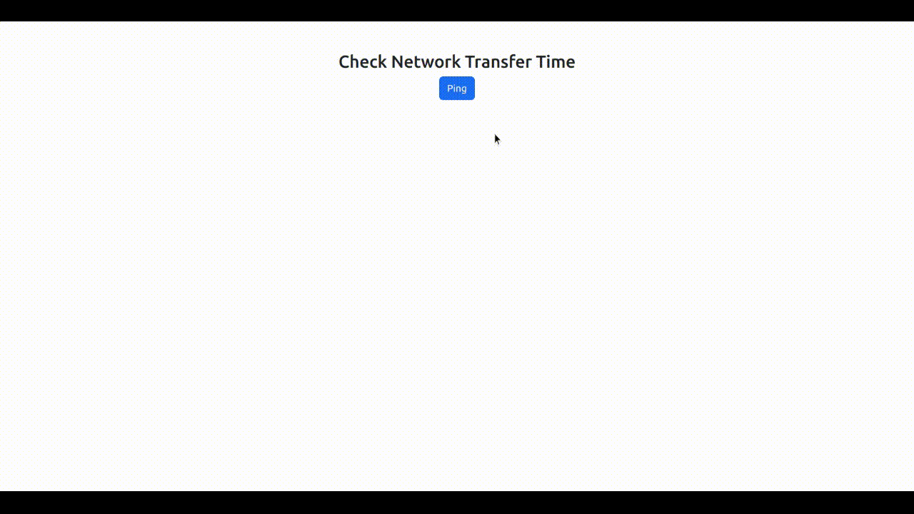

# Ping Your Server to Check How Quick It Is

## Problem

Network response time refers to the amount of time it takes for a server to respond to a client’s request. Measured in milliseconds, the timer starts from the moment a client sends out a request and stops when the client recieves back its first response.

Total network response time is an important metric to track and monitor as it gives us insight into application performance. If the page load time is high, it may indicate that the server is overloaded and having difficulties processing requests or the page has some heavy processing content like large size images.

For optimizing the application perfromance first we need to measure the page load time. So is there any way to measure the total network response time?

## Solution

We can implement a kind of custom tool to measure the total newtork response time using [Rails Hotwire](https://turbo.hotwired.dev/) with a very few lines of code.

Let's add a button to start measuring the total network response time.
```
<%= turbo_frame_tag "start_ping" do %>
  <%= link_to "Ping",
              ping_path,
              data: { turbo_frame: "network_transfer_time" },
              class: 'btn btn-primary' %>
<% end %>

<%= turbo_frame_tag "network_transfer_time" %>
```

I have added the button inside a turbo frame with id `start_ping` and also added another turbo frame with id `network_transfer_time` to display the result. This button sends a get request to `ping` action. For this demo we don't have any logic in the action.

Now Let's create a helper method to compute the result. This method expects the start time in miliseconds.
```
def network_transfer_time(start_time)
  if start_time
    DateTime.now.strftime('%Q').to_i - start_time.to_i
  else
    "NA"
  end
end
```

And now let's add code to display the results in the view file `ping.html.erb`
```
<%= turbo_frame_tag "network_transfer_time" do %>
  <h4><%= network_transfer_time(params[:start_time]) %> ms</h4>
<% end %>
```

We need to send start time with request. To accomplish this we will use a stimulus controller. Add a `PingController` to `app/javascript/controllers`. We are adding an event listener to the controller. 
```
import { Controller } from "@hotwired/stimulus"

export default class extends Controller {
  ping() {
    const url = `${this.element.href}?start_time=${Date.now()}`

    document.addEventListener("turbo:before-fetch-request", function (event) {
      event.preventDefault()
      event.detail.url.href = url
      event.detail.resume()
    });
  }
}
```

And connect this controller with the `Ping` button.
```
<%= link_to "Ping",
            ping_path,
            data: { 
              controller: "ping",
              action: "turbo:click->ping#ping",
              turbo_frame: "network_transfer_time"
            },
            class: 'btn btn-primary' %>
```

Now we want to compute the results every seconds so let's modify the code in the ping controller. 
```
ping() {
  const url = `${this.element.href}?start_time=${Date.now()}`

  this.triggerNextPing()

  this.hideButton()

  document.addEventListener("turbo:before-fetch-request", function (event) {
    event.preventDefault()
    event.detail.url.href = url
    event.detail.resume()
  });
}

triggerNextPing() {
  clearTimeout(this.timeout)

  this.timeout = setTimeout(() => {
    this.element.click()
  }, 1000)
}

hideButton() {
  this.element.style.display = "none";
}
```

let's check the final outcome. Now we are able to see the total network response time every second.


## Discussion
Google considers page speed to be one of the 200 ranking factors that influence a website’s position in organic search results. High website response times also create an unpleasant user experience. We can get an idea about how fast our application runs by checking the ping time and can utilize this for further optimizations.
